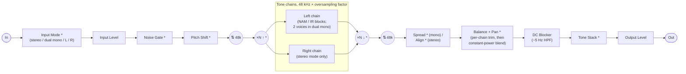
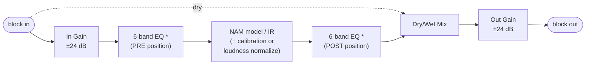

# TONE3000 Plugin

A JUCE-based audio plugin (VST3, AU, CLAP, LV2, Standalone) that loads
**Neural Amp Modeler (NAM)** captures and **impulse responses (IRs)** straight
from [TONE3000](https://www.tone3000.com). No manual file downloads: browse
the catalog, sign in, and add tones directly into your signal chain.

[Download the plugin](https://www.tone3000.com/plugin/download) for a
pre-built installer, or see the
[Plugin Guide](https://www.tone3000.com/guides/tone3000-plugin) for how to
install, load tones, and use it.

- **Load NAM and IR from TONE3000.** Click **+** to search the catalog in
  the plugin: text search, gear / format / tag / make / creator filters,
  verified creators, your recently used, favorited and created tones, all
  over the [TONE3000 API](https://www.tone3000.com/api) after a one-time
  sign-in (OAuth 2.0 + PKCE). Pick a tone and it lands in the chain with the
  right model or IR.
- **Or load local files.** Drag a `.nam` file (A2 architecture), an IR
  `.wav`, or a folder of them onto a **+** slot, or right-click a tile and
  pick **Load File / Load Folder**; no account needed. Design notes in
  [`plugin/docs/local-models.md`](plugin/docs/local-models.md).
- **Build a signal chain.** Multiple NAM and IR blocks, per-block EQ and
  gain/mix, drag to reorder, dual chains in stereo mode with branching,
  undo/redo, and presets. Presets are plain files named after the preset
  (Plugin Settings → Presets opens the folder), so they can be backed up or
  copied between machines.
- **Cross-platform.** One plugin on macOS, Windows, Linux, and iOS
  (Standalone). The UI is JUCE/C++ (`plugin/ui/`), drawn natively on every
  platform: no browser engine, no web runtime, nothing to install beside the
  plugin (see [`plugin/ui/README.md`](plugin/ui/README.md) and the design
  record in [`plugin/docs/native-ui.md`](plugin/docs/native-ui.md)).

NAM processing comes from **NeuralAmpModelerCore** (in-tree), resampling from
**AudioDSPTools** (in-tree), and tone browsing/loading from the
[TONE3000 API](https://www.tone3000.com/api).

## Prerequisites

- [CMake](https://cmake.org/download/) 3.22+ and Git
- **JUCE** is fetched automatically by CMake into `libs/`; no manual install
- A C++20 compiler: Xcode on macOS, MSVC on Windows, GCC or Clang on Linux
  (plus the dev packages listed under
  [Linux runtime dependencies](#linux-runtime-dependencies))

## Quick start

### 1. Get submodules

```sh
git submodule update --init --recursive
```

### 2. Configure CMake

CMake downloads JUCE into `libs/` on first configure.

The default build includes the GUI targets (Standalone, VST3, AU, AAX, LV2,
CLAP). Add `-DHEADLESS=ON` for headless/embedded builds; switch individual
formats off with `-DBUILD_AAX=OFF`, `-DBUILD_LV2=OFF`, `-DBUILD_CLAP=OFF`.
CLAP support comes from
[clap-juce-extensions](https://github.com/free-audio/clap-juce-extensions),
fetched at configure time. `-DT3K_BUILD_UI_TESTBED=ON` adds the UI testbed
(`UiTestbed`: scenario captures, pixel diffs, `--selftest`, `--bench`) and
registers its self-tests with ctest; see
[`plugin/ui/README.md`](plugin/ui/README.md).

```sh
cmake -B build -S . -DCMAKE_BUILD_TYPE=Release   # or Debug
```

**Linux:** use the project's toolchain file:

```sh
cmake -B build -S . -DCMAKE_BUILD_TYPE=Release \
  -DCMAKE_TOOLCHAIN_FILE=cmake/linux-toolchain.cmake
```

If you switch CMake presets later, remove the `build` directory and
reconfigure.

### 3. TONE3000 publishable key

The plugin reads your TONE3000 publishable key at configure time from a
`.env` file at the repo root (`.env.local` overrides it and a variable in
the configure environment overrides both; [`.env.example`](.env.example)
documents every key). Set it before the first build, and reconfigure after
changing it:

```sh
# .env
T3K_PUBLISHABLE_KEY=t3k_pub_your_key_here
# Optional: point at staging or self-hosted TONE3000
# T3K_API_DOMAIN=https://staging.tone3000.com
```

Sign-in opens in the system browser and returns to the plugin through a
loopback redirect on an ephemeral port (`http://localhost:<port>/`).
Localhost redirect URIs are auto-allowed for publishable keys, so nothing
needs registering in TONE3000 > Settings > API Keys.

### Artemis standalone

Build with `-DT3K_ARTEMIS_KIOSK=ON` on Linux for the device's full-screen
standalone. The header back button exits through JUCE so Launchpad can resume.
Text fields use a native on-screen keyboard; knobs use the native JUCE touch
controls. The standalone starts sign-in with TONE3000's phone/QR device flow,
keeping the code visible on the display. The installed JACK server and audio
device settings remain managed by Launchpad. Artemis' OS build wrapper passes
the publishable key to CMake and targets the CM5's Cortex-A76 CPU.

### 4. Build the plugin

```sh
cmake --build build
```

### 5. Run it

**Standalone:**

```sh
cd build/plugin/TONE3000_artefacts/Release/Standalone   # or Debug
```

- macOS: `open ./TONE3000.app`
- Linux: `./TONE3000`
- Windows (PowerShell): `./TONE3000.exe`

To see `DBG()` output in Debug builds, run the binary directly so
stdout/stderr reach your terminal (on macOS that is
`TONE3000.app/Contents/MacOS/TONE3000`).

**In a DAW:** `./script/install-plugin.sh VST3` (or `AU` / `AAX`) installs
the built plugin and the factory presets on macOS and Linux to the same
folders the official installers use (the macOS preset copy goes to
`/Library` and asks for sudo); pass `Debug` as the second argument for the
Debug build, then rescan in your DAW. Artefacts land in
`build/plugin/TONE3000_artefacts/<config>/<format>/`; to copy one by hand
instead, the usual folders are:

| OS      | Format | Install to                                              |
| ------- | ------ | ------------------------------------------------------- |
| macOS   | VST3   | `~/Library/Audio/Plug-Ins/VST3/`                        |
| macOS   | AU     | `~/Library/Audio/Plug-Ins/Components/`                  |
| macOS   | AAX    | `/Library/Application Support/Avid/Audio/Plug-Ins/` |
| macOS   | CLAP   | `~/Library/Audio/Plug-Ins/CLAP/`                        |
| Windows | VST3   | `C:\Program Files\Common Files\VST3\`   |
| Windows | CLAP   | `C:\Program Files\Common Files\CLAP\`   |
| Linux   | VST3   | `~/.vst3/`                              |
| Linux   | LV2    | `~/.lv2/`                               |
| Linux   | CLAP   | `~/.clap/`                              |

## Linux runtime dependencies

Required at run time: GTK3 (file dialogs), ALSA, fontconfig, X11, and libcurl
(TONE3000 API and downloads; loaded lazily by SONAME, so no `-dev` package
is needed on an end-user machine). All of these ship with every mainstream
desktop distribution. The release tarball's `install.sh` checks for them
(`./install.sh --check` to verify without installing).

FreeType is deliberately not on that list: it is built from source (CPM,
pinned in the root `CMakeLists.txt`) and linked statically into every Linux
GUI binary, with its symbols kept local. Plugin hosts that bundle their own
FreeType (the official Ardour / Mixbus builds ship a Debian-11-era copy in
`/opt/<host>/lib`) would otherwise resolve our FreeType 2.13 imports against
that older library and refuse to load the LV2 (`undefined symbol:
FT_Get_Paint`, issue #181).

Building needs the matching development packages; the list CI installs is
in `.github/workflows/build.yml` (`libgtk-3-dev`, `libasound2-dev`,
`libjack-jackd2-dev`, `libcurl4-openssl-dev`, and the X11 `-dev` set;
`libfreetype6-dev` is only there as fontconfig's header dependency).

Optional: a JACK server. The standalone's Audio Driver picker offers JACK
next to ALSA (libjack is loaded at runtime; without a server the driver just
lists no devices). On PipeWire systems (`pipewire-jack`), JACK is the
recommended driver: the ALSA driver's raw hardware devices ("Direct hardware
device without any conversions") open the card exclusively, which takes the
whole interface away from every other app while the standalone runs. The
JACK driver shares it.

## Audio processing

The plugin is a JUCE processor running a chain of NAM and IR blocks, anchored
at 48 kHz (a Lanczos resampler wraps the chain when the host rate differs,
bypassed at 48 kHz).

### Signal flow

The full path in processing order (`TONE3000Processor::processBlock` in
`plugin/src/Processor.cpp`). Stages marked `*` are bypassable or conditional:


```mermaid
flowchart LR
    IN([In]) --> IM["Input Mode *\n(stereo / dual mono / L / R)"]
    IM --> IG["Input Level"]
    IG --> GATE["Noise Gate *"]
    GATE --> TR["Pitch Shift *"]
    TR --> RS(("⇅ 48k"))
    RS --> OS(("×N ↑ *"))
    subgraph CHAINS["Tone chains, 48 kHz × oversampling factor"]
        direction LR
        CL["Left chain\n(NAM / IR blocks;\n2 voices in dual mono)"]
        CR["Right chain\n(stereo mode only)"]
    end
    OS --> CL
    OS --> CR
    CL --> OS2(("×N ↓ *"))
    CR --> OS2
    OS2 --> RS2(("⇅ 48k"))
    RS2 --> IMAGE["Spread * (mono) /\nAlign * (stereo)"]
    IMAGE --> PAN["Balance + Pan *\n(per-chain trim, then\nconstant-power blend)"]
    PAN --> DCB["DC Blocker\n(~5 Hz HPF)"]
    DCB --> TS["Tone Stack *"]
    TS --> OG["Output Level"]
    OG --> OUT([Out])
```

- **Input mode**: when a real stereo source feeds the plugin, a faceplate
  button picks how it enters the chain. Saved with the session, not with
  presets; it's I/O routing, not tone.

  | Row | Mono chain | Stereo chains |
  |---|---|---|
  | **Stereo SUM (L+R)** / **Stereo** (default) | ½(L+R) folded into the one chain | channel 1 → Left chain, channel 2 → Right chain |
  | **Stereo Dual Mono (L&R)** | L and R each run their own copy of the chain | (not offered; a saved selection behaves as Stereo) |
  | **Left** / **Right** | that channel feeds the chain | that channel feeds both chains |

  Dual Mono answers the stereo-track case (a stereo synth or a doubled DI
  through one amp rig) without duplicating the chain by hand: every NAM
  block runs two voices of the model, a stereo IR convolves its left kernel
  for both channels (the pair's spatial cue would otherwise collapse), the
  tone stack, gate and DC blocker are per-channel already, and the two
  voices leave as real L and R. Amp CPU doubles (the voices fork across
  cores with Multi-core on; IR cost is unchanged) and the help text says so.
  Spread stays idle (the chain already outputs two real channels), while
  Balance and Auto Balance work as a trim between the two voices. The mode
  engages only when the chain is mono, the source is stereo and the rig can
  reproduce stereo; on a mono track or one-channel device it behaves as
  Stereo SUM. Switching mode on a mono chain rebuilds its NAM engines from the
  model cache under the same edit fade a chain edit uses, so the change is
  a short mute rather than a click.
- **Noise gate**: a downward expander on the input with a band-passed
  sidechain and 5 dB of hysteresis, so pickup hum never chatters the gate.
  The faceplate exposes the threshold; right-clicking the Gate group
  (Ctrl-click on macOS, touch-and-hold on the knob) opens an advanced deck
  with Release (5-500 ms, how fast the gate closes), Hold (0-200 ms, how
  long it stays open after the signal drops) and Range (20-80 dB, how deep
  it closes; 80 dB is a mute). Attack is fixed at 0.2 ms: with no
  lookahead, a slower attack only softens pick transients.
- **Pitch Shift**: a polyphonic pitch shifter on the clean DI, ahead of the
  amp, so a `-2` plays a standard-tuned guitar as drop D through the whole
  rig, and a MIDI expression pedal on the knob plays it like a whammy. Off
  by default; the faceplate Pitch knob sets the shift, two octaves either
  way (±24), and powering on is what adds latency. The knob is also hidden
  by default: Plugin Settings → Effects picks which of Gate and Pitch Shift
  the faceplate shows (view settings only; an effect that is switched on
  always shows, so a preset that uses it stays reachable). Right-clicking
  the group opens a deck with STEP (on by default: the knob snaps to whole
  semitones, a transpose; off, it sweeps smoothly with Shift-drag for fine
  control), Tonality (1-20 kHz, the
  frequency above which the input bypasses the shifter, which keeps pick
  noise and string squeak natural; Off at the top) and Buffer (the engine's
  delay buffer, 20 / 30 / 40 / 60 ms; the tap's delay sweeps between a 2 ms
  floor and the buffer end, so the latency reported to the host is the
  midpoint, 11 / 16 / 21 / 31 ms). Power, Buffer and Tonality changes blend over
  25 ms like the stereo image's, never click. The engine is a time-domain
  correlation-spliced delay line with onset re-sync, so pick attacks pass
  in a few ms whatever the buffer; the buffer sets the lowest note it holds
  a full period of (20 ms is guitar-only, 30 ms, the default, covers bass)
  and how often it splices. Two octaves up is as clean as one; two octaves
  down is on pitch but grainy, a sub-octave effect rather than a clean
  shift. Each splice crossfades for as long as the
  material needs (30 ms on a single note, up to 120 ms on a chord, where
  no lag lines every string up), so chords sustain without a periodic
  chuff. The research behind it (benchmarks against a phase vocoder,
  candidates, chords, the two-octave range, listening results) is recorded in
  [`plugin/docs/pitch-shift.md`](plugin/docs/pitch-shift.md).
- **Mono mode**: only the Left chain runs and the pan stage is skipped. With
  Spread on, the chain output becomes an ADT-style stereo double; see
  [`plugin/docs/stereo-image.md`](plugin/docs/stereo-image.md) for the design
  (it also covers the stereo-mode Align feature below, and what happens on a
  rig that can't reproduce stereo at all: Spread stays idle and greyed out,
  while stereo chains keep running and are summed to mono).
- **Stereo mode**: channel 0 feeds the Left chain and channel 1 the Right
  chain independently. The Balance trim scales each chain (12 dB opposing)
  before the pan knobs place them with a constant-power law, so a balance
  dialed in to match the chains stays correct at any pan position; each pan
  knob carries a solo that auditions its chain alone (exclusive: engaging
  one clears the other; the mute rides the same smoothed matrix, so it
  never clicks, and stays out of presets) and a polarity flip (Ø) for
  captures that land 180° out (the sign rides the same matrix smoothers, so
  flips glide through zero instead of clicking). Align applies a corrective
  alignment delay (up to 24 ms, sub-sample precise) to one chain, useful when
  NAM models or IRs carry different baked-in latency; the auto-align button
  mutes the output for under half a second, drives both chains with an
  identical internal sweep, and measures the lag and relative polarity from
  the cross-correlation (`plugin/include/AutoOffset.h`). On a rig that can't
  reproduce stereo (mono track, one-channel output device) both chains still
  run and are summed to mono at the output (½(L+R), the host's own mono-fold
  law), with balance/solo/Ø live inside the sum, pans inert, and a MONO chip
  on the pan rail (see the stereo-image doc above).
- **Tone stack**: one global Bass/Middle/Treble EQ after the DC blocker,
  voiced to match the reference
  [NeuralAmpModelerPlugin](https://github.com/sdatkinson/NeuralAmpModelerPlugin)
  tone stack (150 Hz / 425 Hz / 1.8 kHz, ±20 / ±15 / ±10 dB).
- **Oversampling**: a Plugin Settings option runs the whole chain at 2x/4x/8x the
  48 kHz base rate: minimum-phase half-band filters (zero added latency),
  with NAM models phase-interleaved across N native-rate instances so
  harmonics land in the widened band instead of folding back as aliasing.
  IR blocks are the exception: convolution is linear, so each IR convolves
  at the 48 kHz base rate inside a per-block decimate/interpolate island,
  and IR CPU and sound are identical at every factor. Design notes in
  [`plugin/docs/oversampling.md`](plugin/docs/oversampling.md).
- **Multi-core processing**: a Plugin Settings option (on by default,
  machine-wide) spreads independent chain work across a realtime worker
  pool. The two stereo chains process concurrently (the Right chain, or the
  branch lane when branched, on a worker while the audio thread processes
  the other), and a NAM model's instances (oversampling phases × dual-mono
  voices) fork across cores too. The forking thread can always steal jobs back and run them
  inline, so the toggle is pure scheduling and the output is bit-identical
  either way (pinned by `test/src/multicore_tests.cpp`). Design notes in
  [`plugin/docs/multicore.md`](plugin/docs/multicore.md).

Inside every tone block:


```mermaid
flowchart LR
    BIN([block in]) --> BIG["In Gain\n±24 dB"]
    BIN -. dry .-> MIX
    BIG --> PEQ["6-band EQ *\n(PRE position)"]
    PEQ --> MODEL["NAM model / IR\n(+ calibration or\nloudness normalize)"]
    MODEL --> BEQ["6-band EQ *\n(POST position)"]
    BEQ --> MIX["Dry/Wet Mix"]
    MIX --> BOG["Out Gain\n±24 dB"]
    BOG --> BOUT([block out])
```

Each block's 6-band EQ runs in exactly one position: right after the model,
before the dry/wet mix (POST, the default), or between In Gain and the model
(PRE), never both. Either way the EQ only ever shapes the wet signal, never
the mixed dry+wet output. Out Gain sits after the mix: it is the block's
output fader and moves the whole blend, dry share included, at any Mix
setting. A flat or bypassed EQ costs nothing on the audio thread.

Meters tap the signal after input gain (input meters, pre-gate), after each
block's In Gain plus its PRE-position EQ and after its final stage (block
LEDs), and after output gain (output meters).

### Settings and where they live

Every setting belongs to exactly one of these stores, which decides what
survives a new plugin instance, a new DAW, or a switch between the standalone
and a plugin. The two machine-wide files and the presets folder share one
app-data root: `~/Library/Application Support/TONE3000` on macOS,
`%APPDATA%\TONE3000` on Windows, `~/.config/TONE3000` on Linux.

- **Project state** (`getStateInformation`, `plugin/src/ProcessorState.cpp`).
  Per instance: the DAW saves it in the project and hands it back only to
  that instance; a freshly inserted plugin never sees it. Holds every host
  parameter (faceplate knobs and power switches, calibration, oversampling),
  the chain (blocks, per-block EQ / gains / normalization / NAM size, with
  the model bytes embedded so the project reopens offline), the active
  preset, the MIDI map, input mode and the window size. The standalone app
  saves this same blob on quit and restores it on launch, which is why it
  remembers the whole session and a DAW instance remembers nothing on its own.
- **Presets** (files in the user presets folder; `plugin/src/ProcessorPresets.cpp`).
  The chain plus the faceplate parameters that are *tone*: levels, tone
  stack, gate, pitch shift, spread, align, pan, polarity. Deliberately not in
  a preset: calibration (your interface, not the capture), oversampling,
  solo, input mode, MIDI map, window size.
- **Machine-wide processor settings** (`preferences.settings`). Read by every
  new instance in every format and the standalone: multi-core processing,
  the default NAM A2 size for new blocks, and the machine defaults for
  calibration (on/off, dBu level) and oversampling (on/off, factor). The
  last two are still host parameters, so a project reopens exactly as saved
  and automation works; the file seeds a fresh instance, and changing one of
  them in Plugin Settings updates the file (a host restore or automation
  moving the same parameter does not).
- **Machine-wide UI preferences** (`ui-preferences.settings`,
  `plugin/ui/services/UiPrefs.h`). View toggles (Info Bar, which effects the
  faceplate shows, the per-block size and normalization controls, preset PC
  numbers), the TONE3000 sign-in, dismissed banners and update notices.
  Merged across processes under a lock, so a DAW and the standalone never
  overwrite each other's writes.
- **Standalone only** (`TONE3000.settings`, JUCE's standalone holder). Audio
  device, sample rate, buffer, channels, Hear Yourself, MIDI inputs, and the
  saved session state above.

### DSP tests

A GoogleTest suite pins the chain's DSP invariants against the real model and
IR assets in `test/files`:

- `dsp_tests.cpp`: unit-level behavior (oversampler null/transparency/
  aliasing, NAM phase-interleaving exactness, IR island equivalence).
- `processor_tests.cpp`: drives the full `TONE3000Processor` the way a host
  would (48 kHz transparency with zero latency, reported PDC matching the
  measured delay at 44.1/96 kHz, latency stability across oversampling
  toggles, state round trips).
- `multicore_tests.cpp`: parallel stereo output is bit-identical to serial,
  across topologies, host rates, and oversampling factors.
- `gate_tests.cpp`: the noise gate's release / hold / range contracts, and
  the compatibility of the first parameters added after launch (a state
  saved before they existed lands on their defaults; presets carry them).
- `pitch_shift_tests.cpp`: the pitch shifter's contracts (off is bit-exact and
  latency-free, the reported latency matches the engine and tracks the
  power switch alone, 0 st is a pure delay, a shift lands on pitch at unity
  gain, a splice between unrelated taps holds the level, the tonality limit
  passes highs unshifted, a pick attack re-syncs the tap, stereo shares one
  tap, absent parameters in older state fall back to off).
- `spread_tests.cpp`, `swap_fade_tests.cpp`, `branch_tests.cpp`, and friends
  cover the doubler, engine-swap fades, and chain routing.

```sh
./script/test-dsp.sh                        # build + run everything
./script/test-dsp.sh 'IrConvolutionTest.*'  # gtest filter
```

`test/src/os_bench.cpp` is a standalone CPU benchmark for the oversampled NAM
path (build instructions in its header).

### Plugin validation

`./script/validate-plugin.sh` runs each format's official validator against
the built artefacts: [pluginval](https://github.com/Tracktion/pluginval) at
strictness 10 for VST3 and AU (including Apple's `auval`),
[clap-validator](https://github.com/free-audio/clap-validator) for CLAP, and
`lv2lint` for LV2 where available (Linux). AAX (needs Avid's DSH harness and
PACE signing) and Standalone (not a hosted plugin) are skipped. Install
validators with `brew install --cask pluginval` and by dropping a
clap-validator release binary on PATH or in `build/tools/`. Pass a format
and/or build type to narrow the run, e.g. `./script/validate-plugin.sh AU
Debug`.

## Repository layout

| Path            | Contents                                              |
| --------------- | ----------------------------------------------------- |
| `plugin/`       | C++ plugin: processor, DSP, presets, MIDI mapping; vendors NeuralAmpModelerCore and AudioDSPTools |
| `plugin/ui/`    | The JUCE UI: views, widgets, services, testbed (see [plugin/ui/README.md](plugin/ui/README.md)) |
| `plugin/docs/`  | Design docs (UI, spread, oversampling, multi-core, local models) |
| `test/`         | GoogleTest DSP suite + test assets                    |
| `script/`       | Build, packaging, and install helpers                 |
| `tools/`        | Maintainer utilities, not built by default (`PresetTool` regenerates the shipped presets) |
| `libs/`         | CPM-fetched dependencies (JUCE, GoogleTest, ...)      |
| `design/`       | Figma exports and UI reference assets                 |

## Licensing

This project is licensed under the **MIT License** (see [LICENSE](LICENSE)).

JUCE has its own licensing, including optional commercial terms; see
[JUCE Licensing](https://juce.com/legal/juce-9-licence/). **NeuralAmpModelerCore**
carries its own license terms in its directory. **AudioDSPTools**'
`ResamplingContainer` originates from the iPlug2 project (license in that
source). The CLAP build uses **clap-juce-extensions** and the **CLAP** SDK
(both MIT), fetched at configure time.

## Credits

- [Neural Amp Modeler](https://github.com/sdatkinson/neural-amp-modeler) by
  Steven Atkinson: the NAM ecosystem and
  [NeuralAmpModelerCore](https://github.com/sdatkinson/NeuralAmpModelerCore),
  which powers all amp modeling here.
- [NeuralAmpModelerPlugin](https://github.com/sdatkinson/NeuralAmpModelerPlugin):
  the reference NAM plugin; the faceplate tone stack borrows its band voicing
  and the DC blocker matches its behavior.
- [AudioDSPTools](https://github.com/sdatkinson/AudioDSPTools): resampling
  around the 48 kHz chain boundary, with `ResamplingContainer` from
  [iPlug2](https://github.com/iPlug2/iPlug2).
- [NAM-Oversampler](https://github.com/DLC86/NAM-Oversampler) by DLC86:
  oversampled NAM processing; the chain oversampler's half-band
  allpass coefficients are adapted from its AudioDSPTools fork (MIT). See
  [`plugin/docs/oversampling.md`](plugin/docs/oversampling.md).
- Pitch Shift started from a contribution by Vivek Radhakrishna
  ([#133](https://github.com/tone-3000/tone3000-plugin/pull/133)) built on
  [Signalsmith Stretch](https://github.com/Signalsmith-Audio/signalsmith-stretch);
  the shipped engine is the correlation-spliced delay line documented in
  [`plugin/docs/pitch-shift.md`](plugin/docs/pitch-shift.md) (Eventide H949
  de-glitch lineage; Juillerat et al.'s low-latency shifting papers and the
  Signalsmith write-up
  [Four Ways To Write A Pitch-Shifter](https://signalsmith-audio.co.uk/writing/2023/stretch-design/)
  were the references).
- [JUCE](https://juce.com): plugin framework, DSP building blocks, and the
  UI toolkit.
- [clap-juce-extensions](https://github.com/free-audio/clap-juce-extensions):
  the CLAP wrapper.
- O. Das, ["An Open-Source Stereo Widening Plugin"](https://www.dafx.de/paper-archive/2024/papers/DAFx24_paper_92.pdf)
  (DAFx24): the allpass decorrelation approach used by the spread doubler.
- A. Farina, ["Simultaneous Measurement of Impulse Response and Distortion
  with a Swept-Sine Technique"](https://www.melaudia.net/zdoc/sweepSine.PDF)
  (108th AES Convention, 2000) and C. Knapp & G. Carter, "The Generalized
  Correlation Method for Estimation of Time Delay" (IEEE TASSP, 1976): the
  sweep probe and GCC-PHAT estimator behind auto-align.
- [Roboto Mono](https://fonts.google.com/specimen/Roboto+Mono) and
  [Arimo](https://fonts.google.com/specimen/Arimo) (Apache-2.0), embedded in
  the UI; Arimo stands in for Arial where it isn't installed.
- [lucide](https://lucide.dev) icons (ISC), embedded as SVG paths in
  `plugin/ui/core/LucideIcons.h`.

## Saving models to Houston on Artemis

Load a NAM or IR, then touch and hold (or right-click) its tile and choose
**Save to Houston**. The current model is copied to Houston's normal Imports
inbox, ready for its existing import/classification flow. The action also works
offline for models restored from plugin state or presets. It does not change
the playing model or its plugin cache, and an unavailable inbox reports an
error without affecting playback. Repeating the action reuses an identical
copy still waiting in the inbox.

Catalog models carry `source: "t3k"`, and locally loaded files carry
`source: "other"`. Both carry `origin: "plugin"`. A sibling
`<filename>.provenance.json` with `version: 1` is published together with the
asset in a folder for that model; Houston consumes this metadata into its
manifest. The original NAM/WAV bytes
are preserved, including IRs whose playback kernels are trimmed internally.
Saving a local file in the plugin does not give it TONE3000 provenance.

The Artemis UI exposes this option when built with `T3K_ARTEMIS_KIOSK=ON`.
Launchpad supplies `T3K_HOUSTON_IMPORTS_DIR`; when absent, the exporter uses
`LAUNCHPAD_USER_IMPORTS_DIR`, then `Imports` below `LAUNCHPAD_USER_FILES_ROOT`,
`ARTEMIS_USER_FILES_ROOT`, or `/data/artemis/user-files`, in that order.
The default user-files volume must be mounted. Each model gets its own friendly
folder inside `NAM` or `IR` below this inbox. Publishing the complete folder
avoids collisions with browser downloads and incomplete imports. Houston
consumes provenance through its existing manifest importer.

Catalog downloads ordinarily live in each block's in-memory cache; referenced
bytes are embedded in saved processor state and presets. They are not a
general on-disk download library. Local imports separately keep their existing
content-addressed stash in the platform app-data `TONE3000/LocalModels` folder.

`HoustonExportTest.*` in the native DSP suite covers the export contract and
failure isolation. Setting `T3K_HOUSTON_EXPORT_FIXTURE` to an empty temporary
Imports directory retains native NAM/IR exports for cross-repository tests.

## Links

- [TONE3000](https://www.tone3000.com): NAM captures and IRs.
- [Download the plugin](https://www.tone3000.com/plugin/download): pre-built
  installers for Mac, Windows, and Linux.
- [Plugin Guide](https://www.tone3000.com/guides/tone3000-plugin): how to
  install, load tones, and use the plugin.
- [TONE3000 API](https://www.tone3000.com/api): full API reference (the
  browser uses `/tones/search`, `/tones/{downloaded,favorited,created}`,
  `/tags`, `/makes` and `/users`).
- [TONE3000 API examples](https://github.com/tone-3000/api): reference
  integrations, including the `tone3000-client.ts` this plugin's client is
  adapted from.
