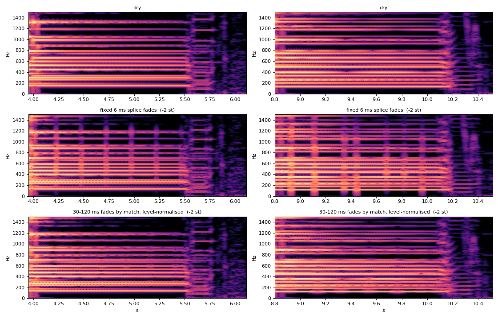

# Pitch Shift: low-latency pitch-shift research

Record of the engine choice behind the Pitch Shift effect (the Pitch knob
on the faceplate: stepped, it transposes; smooth, it sweeps like a whammy).
The feature started from Vivek Radhakrishna's contribution
([#133](https://github.com/tone-3000/tone3000-plugin/pull/133)), which ran
Signalsmith Stretch (a phase vocoder) at 30 / 60 / 100 ms windows. Played
live against a commercial input transpose it was late (60 ms; ~20 ms is
the reference feel) and unstable on bass. This document lists the
candidates that were benchmarked, the scorer, the iterations that failed,
and the engine that shipped: a correlation-spliced delay line with onset
re-sync. Listening tests agreed with the numbers (30, 40 and 60 ms splicer
buffers all pass; the 60 ms vocoder does not). Chords and the two-octave
range have their own sections, each with the problem, what was measured
and how the engine handles it; Implementation lists how the shipped code
differs from the bench prototype.

Assets referenced below live in `plugin/docs/pitch-shift/`. The bench harness
(C++ candidates + Python scorer) is described in enough detail to rebuild;
it was developed outside the repo.

## The problem

A real-time pitch shifter for guitar and bass DI has three requirements
that pull against each other:

- **Latency.** A player feels anything over ~20-25 ms; 60 ms is too late
  for tight rhythm parts.
- **Bass.** A low E on a 4-string is 41 Hz, a 24 ms period. Anything that
  needs a few periods of context needs a 50-100 ms window, outside the
  latency budget.
- **Transients.** Palm mutes, pick attacks and slap have to arrive
  unsmeared and on time.

Phase vocoders trade window length for pitch accuracy. At 30 ms the
frequency resolution is too coarse to separate bass partials: the pitch
wanders by 10-15 cents and inter-partial sidebands appear. At 60 ms the
output is cleaner but still smears bass and is already late. No window
size satisfies both constraints.

## Literature and prior art

- Signalsmith, [Four Ways To Write A Pitch-Shifter](https://signalsmith-audio.co.uk/writing/2023/stretch-design/):
  the design write-up behind the library the first version used. A survey
  of delay-line vs. granular vs. vocoder trade-offs; it concludes the
  vocoder wins on quality when latency is not the constraint.
- N. Juillerat, S. Müller Arisona, S. Schubiger-Banz, *Low Latency Audio
  Pitch Shifting in the Time Domain* (ICALIP 2008) and *Low Latency Audio
  Pitch Shifting in the Frequency Domain* ("Ocean", ICALIP 2010, reference
  Java implementation from MIT). The 2010 algorithm is an STFT shifter
  designed to survive very small FFT sizes by moving bins with per-bin phase
  correction rather than phase-vocoder accumulation. Ported and benchmarked
  (see below); eliminated.
- Eventide H949 "de-glitch" (1977): the origin of the idea used here. A
  pitch shifter is a delay line read at a different rate than it is written,
  so the read tap drifts and must periodically jump back. The H949's
  contribution was picking *where* to jump by waveform correlation so the
  splice lands on a matching phase of the signal. The same lineage runs
  through the Digitech Whammy / Drop family.
- Digitech Drop (polyphonic algorithms from the Whammy DT, 44.1 kHz,
  published frequency response 20 Hz-11 kHz when engaged, "should be first
  in the chain"): the band-limited response suggests a time-domain design,
  and "first in chain" is about feeding the shifter a clean DI. The common
  hardware reference for a low-latency transpose.

## Candidates

All candidates share one interface (`process(in, out, n)` at a fixed pitch
ratio, 128-sample blocks, 48 kHz) and are run through the same scorer.

| name | what it is | nominal latency |
|---|---|---|
| `ss30`, `ss60` | Signalsmith Stretch, 30 / 60 ms window, 4x overlap (the shipped v1 engine) | 30 / 60 ms |
| `ocean1024` | Juillerat 2010 "Ocean" STFT shifter, N=1024, ported from the MIT reference | 21 ms |
| `dual20` | classic two-tap crossfading delay-line shifter (Dattorro / Whammy style), 20 ms loop | 10 ms |
| `splice<N>` | correlation-spliced single-tap delay line, N ms buffer (below) | (2 + N) / 2 ms |

### Correlation-spliced delay line (shipped)

One read tap runs through a ring buffer at the pitch ratio, so its delay
behind the write head drifts linearly between `dMin` (2 ms) and `dMax`
(the buffer size: 20/30/40/60 ms). When it reaches the end of that range it
jumps back. Rather than a fixed jump (the periodic flutter of a two-tap
shifter) it scores every candidate delay in the legal range by how well its
recent waveform matches the current one (normalised cross-correlation over
a 20-25 ms window), then crossfades to the chosen position with a
raised-cosine fade while both taps keep running at the pitch ratio (6 ms in
the prototype and the tables below; the shipped engine's fade follows the
match quality, see Chords). With the splice placed where the two
waveforms agree, the crossfade is nearly inaudible on periodic material.

Two additions to the basic design:

1. **Rate-cost lag selection.** The best-correlated position is usually
   the nearest one, one period away. On an E1+B1 fifth that chose 35 sample
   jumps and spliced 133 times per second, and the fades alone produced
   +12 dB of sidebands. Scoring candidates by damage-per-splice times
   splices-per-second, `(1 - ncc) / jump`, prefers large jumps with good
   enough correlation: 3.3 splices/s and -1.4 dB sidebands on the same test.
2. **Onset re-sync.** On a detected pick attack the tap is spliced to the
   freshest end of the buffer (within `dMin` to `dMin + 4 ms`,
   correlation-chosen, 2 ms fade). The attack arrives 2-7 ms after the dry
   one wherever the tap was, so the felt latency is set by the attacks, not
   by the (2 + N)/2 mean. Steady tone between attacks drifts as usual.

The delay track shows both on a real riff:

Ramps are the tap drifting at the pitch ratio (2^(-2/12) - 1 = -11%
speed, so a ~1.5 s run from 2 to 40 ms); vertical drops to the 2-6 ms
floor line up with the pick attacks in the waveform above; the drops that
land mid-range are correlation splices choosing a big jump.

#### Onset detector iterations

A false trigger on a sustained note is a gratuitous splice; a missed onset
is a late transient. Variants tried, in order:

1. 2 ms / 50 ms energy ratio: false-triggered constantly on bass (142
   splices/s on Downtown).
2. Instant-attack peak follower: never triggered, the follower tracks the
   attack itself.
3. Compare against energy 5 ms earlier: missed palm-muted riffs where the
   previous note is louder than the new attack.
4. High-passed (600 Hz) energy vs. its recent minimum: re-triggered every
   40 ms (refractory period) on steady low notes, because a low note's
   waveform contains periodic HF pulses that look like tiny attacks.
5. Peak-hold only: safe, but caught 36 of 296 attacks in the Power riff.
6. **Final:** 600 Hz HPF energy with 2 ms smoothing, held in 1 ms cells
   for the last 5-49 ms. Trigger when it rises 9 dB over the recent
   *minimum* AND over the recent *maximum* (the second condition is what
   rejects periodic HF pulses: they never exceed their own recent peaks).
   40 ms refractory; the history is reset to the current level on trigger.
   Result: 0-4 false triggers per 3 s steady tone, median attack latency
   7 ms on Mayer. The maximum margin was 1 dB here; the shipped engine
   uses 6 dB, which beating chords do not clear (see Chords).

## The benchmark

`bench` is a CLI that reads raw float32 mono on stdin, runs one candidate at
one ratio in 128-sample blocks, writes the output to stdout, and reports
`latency cpu% splices onsetSplices` on stderr (plus a per-sample record of
the actual read-tap delay via `DELAY_OUT=<file>`). `metrics.py` drives it
over a corpus and scores the results; `render_listen.py` writes 24-bit
listening sets (`dry` + every candidate, time-aligned by nominal latency)
per DI and interval.

### Corpus

- Synthetic: single plucked notes E1, A1 (bass), E2, A2, D3, G3, E4; a power
  chord on E2; open E major; a major third E2+G#2; bass dyads E1+B1 and
  E1+A1. Synthetic notes give known harmonics so sidebands and pitch can be
  measured exactly.
- Real DIs: all 33 files from the
  [neural-amp-modeler-wasm inputs](https://github.com/tone-3000/neural-amp-modeler-wasm/tree/main/ui/public/inputs)
  (29 guitar, 4 bass; 48 kHz, 24-bit mono). Summary rows below use the
  subset Mayer, Power, Pluck, Metalcore, Brit, Fast Thrash, Progression,
  Smooth (guitar) and Downtown, Frogger, Smokin', Rollin' (bass).
- Intervals: -2, -4, -12 semitones (the drop-tuning use cases), -5 on bass.

### Metrics

All wet signals are aligned to the dry by the candidate's nominal latency
before scoring.

- **warble (dB):** RMS of the detrended dry-to-wet envelope ratio in
  sustained regions. Measures the AM that crossfades or vocoder phase errors
  impose. The dry is first re-timed by the splicer's actual per-sample
  delay so the intentional tap drift is not counted as an artifact.
- **sideband (dB):** energy off the expected shifted harmonics vs. on them
  (harmonics found within +/-26 cents of the ideal), on steady synthetic
  notes and chords. The single most audible number: positive means the junk
  is louder than the note.
- **pitch (cents):** standard deviation of the frame-wise f0 error on steady
  single notes, by autocorrelation over frames of at least four periods
  (shorter frames mis-measured a shifted E1).
- **onset (ms):** arrival of each attack relative to nominal latency, by
  cross-correlating dry and wet onset-strength envelopes within +/-45 ms.
  Median is trustworthy; p90 sits around 37 ms for every candidate including
  constant-delay ones, so it is a measurement artifact and is not reported
  here.
- **atk:** attack-time ratio wet / dry (1.0 = transient intact, >1 =
  smeared).
- **cpu%:** share of one core at 128-sample blocks, single thread.
- **splices/s** for the splicer.

### Results

Means over the corpus. Lower is better for warble, sideband and pitch;
"bass" columns are the E1/A1 synthetic cases; "DI onset" is the median
attack arrival relative to nominal latency (negative = earlier than the mean
latency thanks to onset re-sync).

| algo | st | latency ms | cpu% | synth warble | synth sideband dB | pitch cents | bass warble | bass sideband dB | DI warble | DI onset ms | DI atk |
|---|---|---|---|---|---|---|---|---|---|---|---|
| ss60 | -2 | 60 | 0.34 | 0.48 | -8.2 | 4.8 | 0.71 | **+5.3** | 0.47 | -0.9 | 1.11 |
| ss30 | -2 | 30 | 0.36 | 0.35 | **+2.3** | 11.2 | 0.61 | **+10.9** | 0.41 | -0.3 | 1.09 |
| splice20 | -2 | 11 | 0.65 | 0.18 | -14.6 | 2.0 | 0.26 | -4.8 | 0.19 | -1.5 | 0.95 |
| splice30 | -2 | 16 | 0.68 | 0.15 | -19.7 | 0.8 | 0.27 | -6.3 | 0.14 | -4.9 | 1.00 |
| splice40 | -2 | 21 | 0.62 | 0.13 | -21.0 | 0.7 | 0.18 | -7.2 | 0.11 | -6.7 | 1.00 |
| splice60 | -2 | 31 | 0.54 | 0.91* | -23.1 | 1.1 | 1.26* | -11.4 | 0.10 | -8.9 | 1.01 |
| ss60 | -4 | 60 | 0.33 | 0.56 | -6.8 | 26.3 | 0.82 | **+12.2** | 0.59 | -1.7 | 1.19 |
| ss30 | -4 | 30 | 0.36 | 0.43 | **+8.5** | 30.0 | 0.67 | **+12.5** | 0.48 | -0.7 | 1.14 |
| splice20 | -4 | 11 | 1.09 | 0.28 | -11.9 | 24.1 | 0.45 | -1.3 | 0.24 | -1.4 | 1.08 |
| splice30 | -4 | 16 | 1.37 | 0.15 | -16.5 | 2.7 | 0.28 | -1.7 | 0.19 | -3.2 | 1.09 |
| splice40 | -4 | 21 | 1.33 | 0.21 | -17.8 | 2.1 | 0.30 | -4.2 | 0.18 | -4.8 | 1.09 |
| splice60 | -4 | 31 | 1.17 | 0.84* | -20.0 | 1.5 | 0.11 | -7.7 | 0.14 | -6.2 | 1.08 |
| ss60 | -12 | 60 | 0.32 | 0.76 | -1.0 | 2.6 | 1.03 | +2.5 | 0.96 | -2.2 | 1.38 |
| ss30 | -12 | 30 | 0.34 | 0.64 | +7.2 | 12.6 | 0.97 | +4.7 | 0.74 | -0.2 | 1.24 |
| splice30 | -12 | 16 | 3.21 | 0.27 | -12.5 | 1.3 | 0.41 | -5.8 | 0.32 | -0.6 | 1.31 |
| splice40 | -12 | 21 | 3.35 | 0.27 | -12.3 | 2.3 | 0.60 | -4.2 | 0.25 | -0.7 | 1.32 |
| splice60 | -12 | 31 | 3.48 | 0.18 | -14.1 | 1.5 | 0.22 | -6.0 | 0.25 | -1.6 | 1.31 |

\* `splice60` synthetic warble is an artifact of the warble metric's
detrending window colliding with the long delay ramp; its DI warble (the
number that matters) is the best of the set.

Earlier-round candidates, -2 st, same scorer before the delay-aware warble
fix (so their warble is not comparable to the table above; sidebands and
pitch are):

| algo | latency ms | synth sideband dB | pitch cents | bass sideband dB |
|---|---|---|---|---|
| ocean1024 | 21 | +15.0 | 24.6 | +17.6 |
| dual20 | 10 | -1.3 | 0.6 | +5.4 |

Ocean scored worst on every axis at a size that met the latency budget.
The dual-tap shifter has exact pitch (it never splices) but its constant
crossfading is the classic flutter, worst on bass where a 20 ms loop cannot
hold a period.

Observations:

- The splicer scores better than the vocoder on every metric at every
  interval at a third to a quarter of the latency. At -2 st, `splice40` vs
  `ss60`: pitch 0.7 vs 4.8 cents, sidebands -21 vs -8 dB, bass sidebands -7
  vs +5 dB, DI warble 0.11 vs 0.47 dB.
- Positive sideband levels (the off-harmonic energy louder than the note)
  occur only for the vocoder, and only on bass. The splicer keeps bass
  sidebands negative at every buffer size >= 30 ms.
- Onset re-sync: DI onsets arrive 5-9 ms before the mean latency and the
  attack-time ratio stays at 1.0 (vocoder: 1.1-1.4).
- CPU is higher than the vocoder (0.6% vs 0.3% at -2 st, 3.4% at -12 st)
  because the table's correlation search is exhaustive. The shipped engine
  uses a coarse-to-fine search (see Implementation): 0.3% / 0.9% with
  identical results.
- **20 ms** (`splice20`, 11 ms mean latency) works for guitar: pitch and
  sidebands are a few dB behind 30 ms and it passed listening on the
  guitar sets. It does not work for low bass: a 20 ms buffer cannot hold an
  E1 period (24 ms), so the E1 cases go from -14 dB to +9 dB sidebands and
  the -4 st pitch column fails on that note. 25 ms sits between (E1
  sidebands +1.5 dB). Bass needs 30 ms or more, so the Latency control
  stays, labelled by buffer size, with 20 ms as a guitar-only setting.

### Spectrograms

Downtown - Bass, -2 st, 2.5 s excerpt, 0-1.2 kHz. Dry (top), vocoder
(middle), splicer (bottom). The vocoder fills the space between partials
with noise, most visibly at 400-800 Hz and around each attack; the splicer
keeps each partial as a line, shifted down 2 st:

Power - Guitar, -2 st, 0-3 kHz:

### Audio examples

5 s excerpts, 48 kHz 16-bit, peak-normalised as a set so levels match:

- Guitar (Power - Guitar, -2 st):
  [dry](pitch-shift/guitar_-2st_dry.wav),
  [Signalsmith 60 ms](pitch-shift/guitar_-2st_ss60.wav),
  [splicer 40 ms](pitch-shift/guitar_-2st_splice40.wav)
- Bass (Downtown - Bass, -2 st):
  [dry](pitch-shift/bass_-2st_dry.wav),
  [Signalsmith 60 ms](pitch-shift/bass_-2st_ss60.wav),
  [splicer 40 ms](pitch-shift/bass_-2st_splice40.wav)

The wet files are aligned to the dry by nominal latency, so A/B'ing them in
a DAW compares artifacts, not delay.

## Chords

The corpus above is mostly single notes, riffs and a few chords. Sustained
open chords are the splicer's hardest case, and a hand-played take of open
chords at -2 st (30 ms buffer) against a commercial input transpose is
where the two are told apart: on single notes and riffs they are hard to
distinguish; on a sustained chord a splicer with a short fixed crossfade
has a soft, periodic "chuff", a few times a second. In the spectrogram it
is a vertical bar at each drift splice, filling the gaps between the
partials.

### Why chords splice badly

A single note has a period, so the lag search finds a jump that is a whole
number of periods and every partial lines up across the splice. A chord has
no common period. The best lag lines up one string's partials and leaves
the others with a phase step, and a 6 ms crossfade turns each step into a
6 ms event, ~170 Hz wide in frequency: wide enough to spill into the
valleys between partials. With five or six strings' worth of mismatched
partials the spill adds up to a broadband bump at every splice. The same
step spread over 120 ms is ~8 Hz wide and stays under the partial.

A chord also fools a naive onset detector. Its strings beat against each
other, and the beating swings the high-passed energy the detector watches
by a few dB; with a "new peak" condition of 1 dB over the recent maximum,
the swells pass for pick attacks (the 17 s chord section, seven strums,
logged 38 re-syncs). A false re-sync is the worst kind of splice: a 2 ms
fade at an arbitrary lag.

### Metric

`valley excess`: per 2.5 ms STFT frame (4096 Hann), the 25th-percentile
level over 100-1500 Hz is the floor between the partials; subtract its
400 ms running median and a splice bump shows as a positive excursion.
Reported over sustained frames (onsets masked from the clean take): mean
and 95th percentile in dB, and bumps per second (peaks over 6 dB).

### What was tried

Each variant was rendered from the same take and scored per section
(chords / riff / bass / dissonant bass dyads), so a fix for the chords
could not quietly cost the riffs: fixed longer fades (12, 20, 30, 45, 60,
80, 120 ms), which help the chords in proportion to their length but put a
long fade under every splice, single notes included; fade length by match
quality, which gives the long fade only where it is needed; a
pre-emphasised control signal for the lag search; a higher detector
high-pass (1500 / 2500 Hz) against the false re-syncs; the detector
ceiling at 3, 4, 5 and 6 dB; and a third tap so an onset arriving inside a
long drift fade could cut straight in. The combination below scored best on
every section; the third tap and the pre-emphasis bought nothing
measurable.

### How the engine handles chords

1. **Fade length follows the match.** A drift splice fades over 30 ms when
   its lag correlates at 0.95 or better, stretching linearly to 120 ms at
   0.6 or worse. A downshift tap only runs deeper while it fades, so the
   fade may last until the destination reaches the buffer end (less the
   next search's lead). An upshift tap gains on the write head, so its
   longest fade is capped to a sixth of the range and the guard moves out
   by that drift (see Two octaves for the wider range's budget).
2. **Level-normalised crossfade.** Two taps that don't correlate add in
   power, not amplitude: a plain complementary fade dips 3 dB in the middle
   when the taps are unrelated, which over 120 ms is a pump. The fade gains
   are normalised by the taps' measured correlation (r = 1 leaves the
   complementary fade, r = 0 is the equal-power one), so the level holds
   whatever the match.
3. **Detector ceiling 6 dB.** An attack has to rise 9 dB over the recent
   floor and 6 dB over the recent ceiling, which a beating chord does not
   reach. Real attacks on the corpus are unaffected (the onset columns
   below).

On the chord take, -2 st, 30 ms buffer, against the same engine with a
fixed 6 ms fade and a 1 dB ceiling:

| section | | clean | fixed 6 ms fade | adaptive fade |
|---|---|---|---|---|
| chords | valley excess mean / p95 dB | 0.55 / 7.0 | 1.60 / 15.8 | 0.59 / 7.3 |
| | bumps/s | 1.1 | 5.2 | 1.2 |
| | re-syncs / drift splices in 17 s | | 38 / 66 | 16 / 74 |
| riff | valley excess mean / p95 dB | 0.73 / 22.4 | 1.56 / 22.0 | 1.32 / 21.8 |
| | bumps/s | 2.3 | 4.7 | 2.4 |
| bass | valley excess mean / p95 dB | 4.49 / 35.8 | 6.10 / 41.1 | 5.25 / 39.8 |
| | bumps/s | 4.1 | 4.4 | 4.7 |

The chord section lands on the clean take's own figures (its bumps are the
strums). Listening agrees: no chuff, and the riff and bass sections are
indistinguishable from the fixed-fade render.

Excerpts, first four chords of the take (9 s, 48 kHz 16-bit, aligned by
nominal latency, peak-normalised as a set):
[dry](pitch-shift/chords_-2st_dry.wav),
[fixed 6 ms fade](pitch-shift/chords_-2st_fixed6ms.wav),
[adaptive fade](pitch-shift/chords_-2st_adaptive.wav).

On the full corpus (same scorer as the tables above, 30 ms buffer, means;
each cell is fixed 6 ms fade -> adaptive fade):

| st | synth sideband dB | pitch cents | bass sideband dB | DI warble | DI onset ms | DI atk |
|---|---|---|---|---|---|---|
| -2 | -20.4 -> **-23.7** | 1.1 -> 0.6 | -7.0 -> **-11.1** | 1.84 -> 1.79 | -5.1 -> -1.4 | 1.00 -> 1.01 |
| -4 | -16.5 -> **-19.4** | 2.6 -> 0.8 | -2.1 -> -4.2 | 1.74 -> 1.75 | -3.0 -> 0.2 | 1.11 -> 1.10 |
| -12 | -12.2 -> -13.2 | 1.3 -> 0.9 | -5.2 -> -5.2 | 1.84 -> 2.34 | 0.6 -> 2.9 | 1.32 -> 1.39 |
| +4 | -19.1 -> **-23.6** | 1.6 -> 1.5 | -6.2 -> **-15.2** | 1.68 -> 1.49 | -1.4 -> -2.6 | 0.88 -> 0.89 |
| +12 | -17.6 -> -17.6 | 0.4 -> 0.4 | -9.6 -> -9.6 | 1.16 -> 1.14 | -1.1 -> -0.7 | 0.69 -> 0.66 |

Sidebands (the corpus's chords and dyads are where they live) are 3-9 dB
lower at every interval the long fade can reach; +12 st is identical
because its geometry caps the fade short. Pitch is tighter. The costs: DI
onsets arrive 2-4 ms later on average (the false re-syncs the 1 dB ceiling
fired on swells counted as early arrivals; real attacks still land within
the floor + re-sync span, see the unit test), and at -12 st the DI warble
is 2.3 dB against 1.8, a 120 ms fade under a fast riff being more visible
than a 6 ms one. CPU is the same (0.22-0.37%).

## Two octaves

Pitch covers -24..+24 st. Up to an octave either way is the plain case
above; two octaves stresses the geometry in different ways up and down.

### Up

An upshift tap gains on the write head at (ratio - 1) samples a sample:
three at +24. Everything one cycle does costs buffer at that rate: the fade
that lands the tap, the next search's lead, the fade after it. Whatever is
left is the range of jumps a splice may choose from, and a splice is only
clean at a whole number of periods, so that range has to be at least a
period long for every note to have one in it. On the 30 ms buffer at +24
the chord geometry's 6 ms fade and 4 ms lead alone want 2300 samples of a
1440-sample buffer: the landing range collapses to a point, the splice is
whatever lag falls there, and the pitch is wrong (440 Hz plays at 1790 Hz
instead of 1760; on the note bench the range of jumps holds a multiple of
E2's period but not A2's, so every other note is a quarter tone off).

The engine budgets for it. Half the buffer is kept as the landing range,
so the range of jumps is at least half a buffer long (on 30 ms, a whole
period of any note above 67 Hz); where the fades and lead don't fit beside
it they shrink together. The budget binds only above +8 st on 20 ms and
+11 st on 30 ms, so the chord behaviour above is unaffected; at +12 st on
30 ms the fade is 5.5 ms instead of 6. Landing shares of a sixth and a
third were also measured: the fades stay longer, and notes whose period
the range misses stay off-pitch.

### Down

A downshift tap only runs deeper, so nothing collapses, but at a quarter of
the input rate it falls back through the buffer and splices every ~40 ms,
each splice repeating ~30 ms of input. That is audible as grain on
anything sustained.

### Measurements

Note bench (steady synthetic notes; guitar = E2..E4, bass = E1, A1),
30 ms buffer:

| st | guitar pitch max cents | guitar sideband dB | bass pitch max cents | bass sideband dB |
|---|---|---|---|---|
| +12 | 0.9 | -27.3 | 1.4 | -25.2 |
| +24 | 0.3 | -25.8 | 0.6 | -22.7 |
| -12 | 1.3 | -22.3 | 1.4 | -9.8 |
| -24 | 3.4 | -9.1 | 1.6 | -2.3 |

On the corpus (synth chords + DIs), +24 st on 30 ms scores -17.0 dB
sidebands and 0.98 dB DI warble against -19.4 dB and 1.04 dB at +12: two
octaves up is as clean as one. Two octaves down is on pitch but grainy:
sidebands sit 10-15 dB above the -12 st figures on every buffer, and the
longer buffers help (-12.4 dB on 60 ms). It is a usable sub-octave effect,
not a clean shift. The 20 ms buffer is guitar-only at every interval: a
bass note's period does not fit it.

## Controls

- **Pitch**, -24..+24 st, a continuous parameter.
- **STEP** (on by default) snaps the knob to whole semitones, which is the
  transpose use; off, the knob sweeps smoothly and Shift-drag is the fine
  control, so it plays like a whammy (map a MIDI expression pedal to it).
  The engine only ever sees a semitone value; the processor rounds it while
  STEP is on.
- **Tonality**, the crossover above which the input bypasses the shifter.
- **Buffer**, the shifter's delay buffer, 20 / 30 / 40 / 60 ms. The tap's
  delay sweeps between the 2 ms floor and the buffer end, and the host is
  told the midpoint, (2 + N) / 2 = 11 / 16 / 21 / 31 ms.

A smooth sweep asks the engine for a new ratio every block. A pending lag
search is planned for a drift, so a same-direction change of up to 0.1 in
ratio (~1.7 st around unity) keeps it: the landing moves by a few samples,
inside the landing range's margins, and the tap never reaches the buffer
end without a splice planned. A direction flip or a bigger jump starts the
search over, and a plan whose destination lies ahead of the write head is
dropped at the splice.

## Implementation

The shipped engine is `plugin/include/PitchShift.h` /
`plugin/src/PitchShift.cpp`; Signalsmith Stretch and Linear are not
dependencies. Where it differs from the bench prototype:

- **Coarse-to-fine lag search.** Candidates are scored every 4 samples (at
  48 kHz; the step scales with the rate) and the best is refined to the
  sample. Identical sidebands, pitch and onset figures to the exhaustive
  search at a third of the cost (0.3% vs 0.7% of a core at -2 st, 0.9% vs
  3.0% at -12 st).
- **Spread lag search.** The prototype ran each search as one burst inside
  a single sample (400-800 us at 48 kHz for 30-60 ms buffers), which
  exceeds a 16-sample host buffer's 333 us budget and clicked on sustained
  notes. A drift splice is predictable (the tap approaches the buffer end
  at a known rate), so the search starts 4 ms early and scores a few
  candidates per sample; candidate positions are shifted by the drift the
  tap makes during the lead so the landing range is unchanged. The
  correlation runs on a mirrored ring (every sample written twice) so each
  window is contiguous and the dot product vectorises. Worst block at 16
  samples: 13-100 us; average CPU 0.15-0.35%. Only the onset re-sync (a
  4 ms candidate range) searches at once.
- **Adaptive, level-normalised fade** (see Chords). A drift splice fades
  over 30 ms at a correlation of 0.95 or better, up to 120 ms at 0.6 or
  worse, and the two taps' gains are normalised by that correlation so the
  level holds through the fade. The onset re-sync keeps its 2 ms fade.
  Above +8 st on 20 ms and +11 st on 30 ms the upshift fade and search lead
  shrink so half the buffer stays free to land in (see Two octaves).
- **Fixed floor.** The prototype moved the 2 ms floor out for upshifts;
  the plugin keeps the reported latency independent of the knob and moves
  the splice trigger out by the distance an upshift tap gains during its
  longest fade (`max(floor, fade shrink)`; summing them instead landed
  +12 st on the 20 ms buffer 9 cents low).
- **Stereo** shares one control path (detector and lag search on the
  channel mean) and one tap position; each channel has its own ring, so
  the image cannot smear.
- **Tonality** keeps its parameter and knob as an LR4 crossover after the
  shifter: the band below the limit from the shifted signal, the band above
  from the dry, delayed by the floor so it lands with the re-synced
  attacks. The crossover output is blended against the plain shift. Both
  filters run whether or not the limit is engaged (four biquads a channel)
  so engaging it does not start them cold. The rings hold full-band audio,
  so the lag search is unaffected.
- **Buffer knob** = the delay buffer, four detents 20 / 30 / 40 / 60 ms,
  default 30 ms; the latency each reports is (2 + N) / 2 = 11 / 16 / 21 /
  31 ms.
- **STEP** lives in the processor: the semitone parameter is a float, and
  the processor rounds it for the engine while STEP is on; the knob snaps
  to detents. The engine has no notion of the toggle.
- **Transitions blend** over 25 ms, like the image decks'. Power
  crossfades dry and wet; the engine keeps running until the fade-out
  lands, then the processor bypasses it, so off stays bit-exact. The
  blend-in waits one floor delay after the reset, since the tap reads the
  cleared ring until then and ramping onto that edge stepped at 8% wet. A
  window change keeps the rings (sized for the largest window) and drops
  only the pending search; a tap outside the new range splices back in
  through an ordinary crossfade. Tonality engage relies on the always-warm
  filters above: a cold highpass passed the mid-cycle start into the dry
  ring as a step.
- Verified by wrapping the plugin class as a bench candidate: every metric
  matches the `splice` prototype at the same buffer within noise.

Unit tests (`test/src/pitch_shift_tests.cpp`): latency figure matches the
engine at every window and rate; 0 st is a pure delay at the floor at unity
gain; ±1 and ±2 octaves land on frequency at every window, and so does a
fractional shift; shifted tones keep unity
gain at every window (splices land on whole periods); a splice between
uncorrelated taps (shifted noise, every fade at its 120 ms longest) holds
the level within 1 dB; the tonality limit passes a 6 kHz partial unshifted
while shifting a 440 Hz one; a pick attack
after a drifting sustain arrives within floor + re-sync span + fade
(measured 2.6-7 ms); stereo channels stay exactly proportional through every
splice; +12 st on the 20 ms buffer stays within 3 cents; mono buffers,
rate / block / window changes and ±24 st stay finite; a smooth sweep
0 -> +24 -> -24 -> 0 over four seconds (STEP off) passes a 220 Hz tone with
no step and no hole; power on/off, a
60 to 20 ms window change and a tonality engage all pass a 220 Hz tone
with no sample step over twice the tone's own and no hole, and a powered-off
engine reports itself stopped within 50 ms.

## Open items

- Upshift attacks: the re-sync target sits at the front of the buffer and
  an upshift tap runs toward the write head, so at +12 st it hits the
  guard within ~4 ms and splices again in the attack's decay. Not yet
  evaluated by listening; a ratio-aware re-sync target is the fix if it is
  audible.
- Long-term: a polyphonic-aware lag search (score per-band) for chords with
  very different fundamentals, which is where the remaining -12 st
  sidebands live. The long fade hides a chord's mismatched partials; a
  per-band search would line them up instead.
- The bench itself lives outside the repo (`/tmp/t3k-bench`: `bench.cpp`,
  `shifters.h`, `metrics.py`, `render_listen.py`, `doc_assets.py`, plus a
  `plugin_shifter.h` wrapper that scores the shipped class, and for the
  chord take `bars.py` (valley excess) and `glitch.py` (per-partial
  instantaneous frequency deviation).
